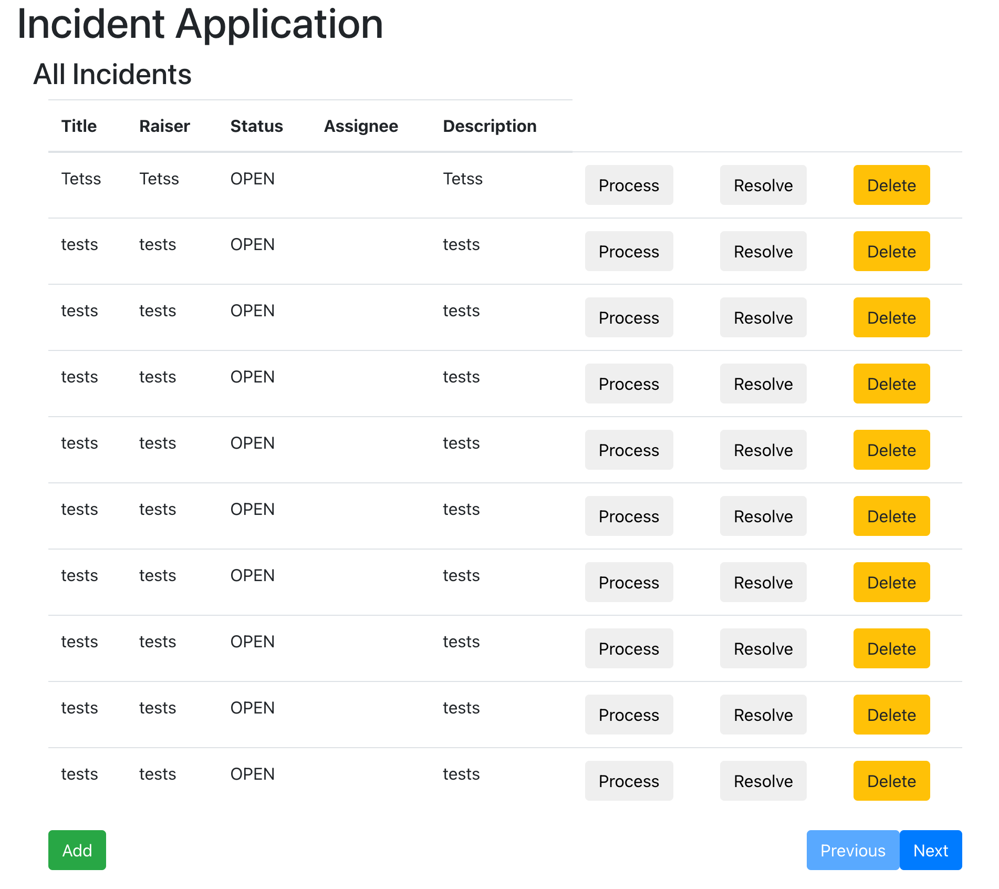
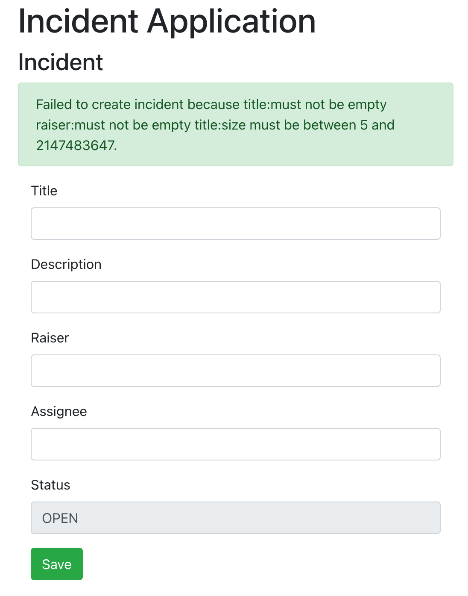
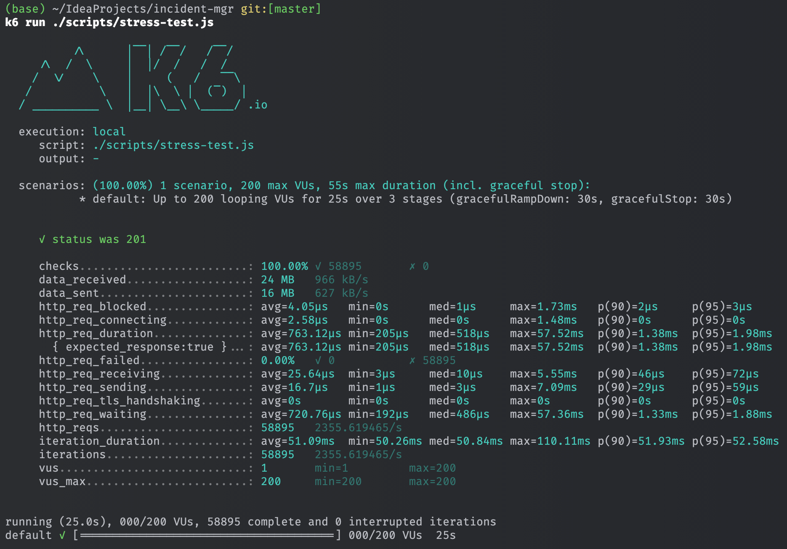

# Incident Management

## Introduction

This service provide incident management capability as a standalone independent microservice. 
It follows the RESTful API design principles and uses Spring Boot as the framework.

It uses Spring Data REST framework for basic simple CRUD operations, 
whereas customize complex APIs are implemented in the controllers.

## Functionalities

### Spring Data REST based pure CRUD APIs.

These set of APIs are usually used in internal automation or testing, should not be exposed to customer directly.

| Method | URL                 | Description                                                |
|--------|---------------------|------------------------------------------------------------|
| GET    | /rest/incident      | Get all incidents with parameters                          |
| POST   | /rest/incident      | Create a new incident                                      |
| GET    | /rest/incident/{id} | Get an incident by id                                      |
| PATCH  | /rest/incident/{id} | Update an incident by id and a set of changed properties   |
| DELETE | /rest/incident/{id} | Delete an incident by id                                   |

### Customized domain driven APIs with RESTful design.

These set of APIs are designed for domain driven business logic with proper validation, it is the one that should be exposed to customer.

| Method | URL                        | Description                                            |
|--------|----------------------------|--------------------------------------------------------|
| GET    | /api/incident/{id}         | Get an incident by id                                  |
| GET    | /api/incident              | Get all incidents with known attributes as parameters  |
| POST   | /api/incident              | Fire a new incident                                    |
| PATCH  | /api/incident:process/{id} | Mark an incident as has been picked up for processing. |
| PATCH  | /api/incident:close/{id}   | Close an incident when it is finished.                 |
| DELETE | /api/incident/{id}         | Delete an incident by id                               |

### Error Handling

#### Example response

```json
{
    "type": "about:blank",
    "title": "Bad Request",
    "status": 400,
    "detail": "Incident cannot be processing because it is CLOSED",
    "instance": "/api/incident:process/7d2da9f3-d955-4828-9e14-93cfffaa7d36"
}
```

## How to run

### Backend

In your working directory is in the root of the project, do:

1. Build Image. It will produce an image named `incident-mgr` which is used in the `docker-compose.yaml`.
    ```shell
    ./mvnw spring-boot:build-image
    ```
2. Run
    ```shell
    docker-compose up -d
    ```
   
### Frontend (Optional)

docker-compose should have brought up everything, if you want to run the frontend separately, do these:

Depending on scenarios:

* For local development
   ```shell
   cd react-crud
   npm install
   npm start
   ```

* From docker-compose
   ```shell
   docker-compose up incident-portal
   ```

Navigate to [portal page](http://localhost:3000) to access the frontend. 

Here is the screenshot of the list page:


And a page to raise new incident:



### IntelliJ IDEA

The `IndicentMgrApplication.run.xml` as been committed to the repository, you can import it to IntelliJ IDEA to run the application directly.

## Performance Benchmark

* [Install K6](https://grafana.com/docs/k6/latest/set-up/install-k6/)
* With a local API instance running, run
   ```shell
   k6 run ./scripts/stress-test.js
   ```
   Then you will see something like this:
   

According to above statistics, the TPS incident creation API is around 2300 (given in-memory database.) and p(95) latency is 2ms.

## Libraries Used

* [Flyway](https://github.com/flyway/flyway): A database DevOps framework manage database changes along with application change.
* [Lombok](https://projectlombok.org/): A library to reduce boilerplate code in Java to improve code readability and productivity.
* [H2 Database](https://github.com/h2database/h2database): A in-memory database for development and testing, keep the code compatible with other databases regardless DB persistence is needed.
* [Micrometer](https://micrometer.io/): Expose Application Runtime Metrics.
* [Caffeine](https://github.com/ben-manes/caffeine): An in-memory cache library with more configuration options than default HashMap, works as a provider of Spring Cache Framework.

## Known Issues

* Spring Data REST doesn't support hibernate annotation `org.hibernate.annotations.SQLDelete` for soft deletion.

## Roadmaps

* Support comments, changelog etc in a separate table. 
* Separate the frontend from the backend into two independent code repos.
